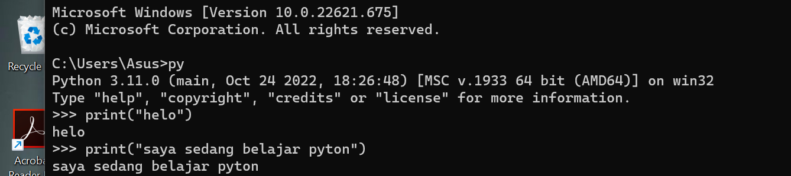
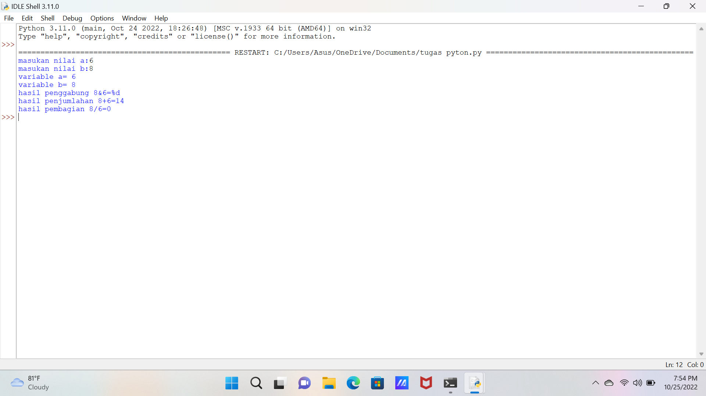

#lab2py
# Menjalankan python
1. Pastikan anda sudah menginstall aplikasi python
# Menjalankan latihan 1 menggunakan cmd bawaan windows

# Menjalankan latihan 2 menggunakan cmd bawaan windows

# Menjalankan latihan 3 menggunakan IDLE python

hasilnya

